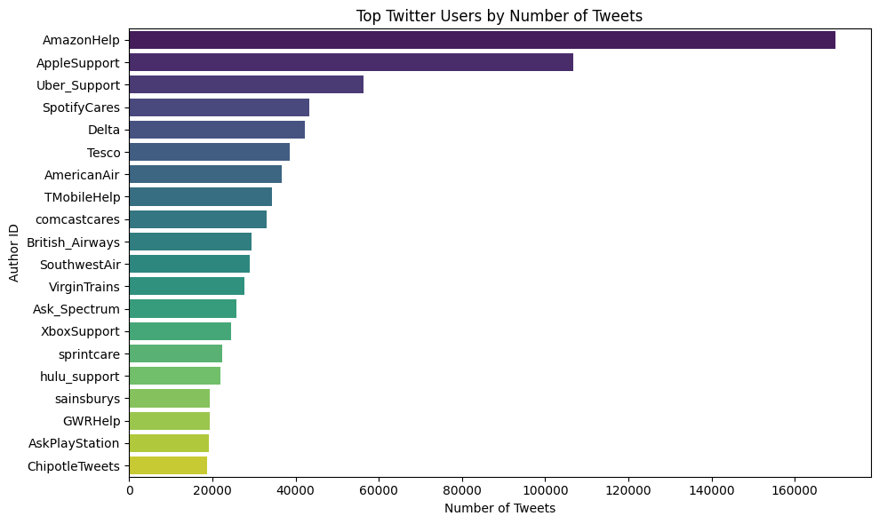
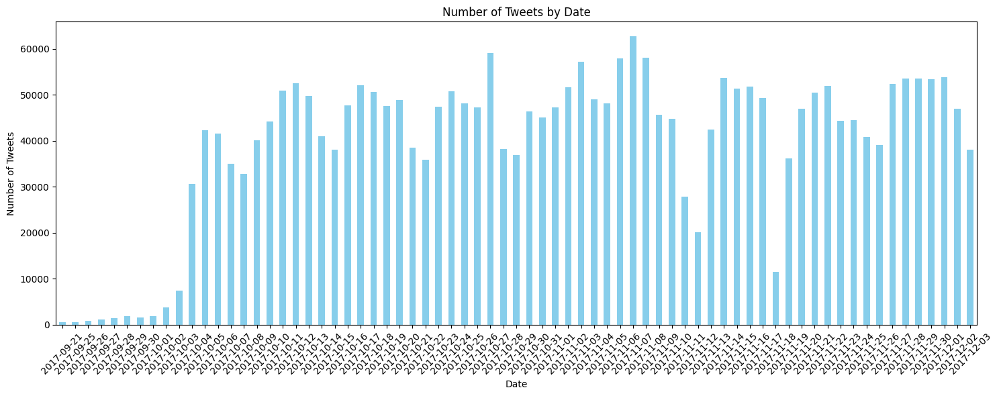

# Twitter Customer Service — Response Analysis

An exploratory data analysis of the [Twitter Customer Support](https://www.kaggle.com/datasets/thoughtvector/customer-support-on-twitter) dataset (~2.8M tweets, Oct–Dec 2017), comparing how large companies handle customer service on Twitter. The analysis centers on Amazon vs. Apple: which gets more support traffic, how fast each responds, and whether faster response correlates with more satisfied customers.

---

## Pipeline

**1. Preprocessing** — load, inspect (`.describe()`, missing values, duplicates, outliers), and convert timestamps to a consistent unit for downstream grouping.

**2. Exploratory analysis**



The top 20 most active accounts are almost entirely corporate support handles — AmazonHelp, AppleSupport, Uber_Support, SpotifyCares, and similar — confirming the dataset is dominated by real customer-service traffic rather than noise.



Volume grows roughly exponentially from October through December 2017. One plausible contributor, based on general knowledge of that period: heightened political activity on Twitter driving overall platform usage up.

**3. Text cleaning** — clean tweet text to prepare it for content-level analysis.

**4. Analysis — Amazon vs. Apple**

| Question | Finding |
|---|---|
| Product-variety mentions | Apple: 63,230 tweets vs. Amazon: 10,655 — Apple gets more volume here despite Amazon's broader catalog |
| Average response time | Amazon: ~34 minutes vs. Apple: ~12 hours |
| Inbound volume | Amazon: 169,576 vs. Apple: 106,804 |
| Customer satisfaction rate | Roughly equal between the two, despite the response-time gap |

---

## Conclusion

**Hypothesis going in:** Amazon would lead on product variety, online presence, *and* service quality, given its scale.

**What the data showed:** mixed. Amazon responds far faster and handles more inbound volume, but Apple actually receives more product-related tweets — and satisfaction rates end up close either way. Response speed alone doesn't appear to drive the satisfaction outcome here.

**Limitations:** the dataset is a snapshot of late 2017 — Twitter suspended roughly 58 million accounts in that window, and support practices at both companies have likely changed since. Findings should be read as a study of that period, not a current comparison.

---

## Setup

```bash
pip install pandas numpy matplotlib seaborn
```

Data: [Twitter Customer Support on Kaggle](https://www.kaggle.com/datasets/thoughtvector/customer-support-on-twitter). Run [`customer-tweet-response.ipynb`](customer-tweet-response.ipynb) top to bottom.
